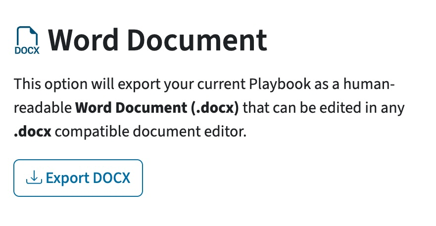

<!--
Pandoc Manual
https://pandoc.org/MANUAL.html

Render to HTML
pandoc --from markdown+link_attributes+implicit_figures --strip-comments --section-divs --standalone --toc --toc-depth=6 --to html -o user_guide.html user_guide.md
-->

---
lang: en-US

colorlinks: true
linkcolor: blue
urlcolor: blue
toccolor: black
mainfont: Arial

title: Playbook-NG User Guide
date: Updated March 25th, 2025
---

## 1. Introduction

Welcome to Playbook-NG! Playbook-NG is an application, developed by CISA Threat Hunting, that is designed to facilitate the creation of Countermeasure Playbooks through the usage of ATT&CK-based cybersecurity findings.

### 1.1 Intended Audience

The intended audience for Playbook-NG is cybersecurity professionals, such as defensive cyber operations (DCO) engineers, who have some familiarity with the MITRE ATT&CK framework along with related concepts such as privilege escalation and persistence.

### 1.2 What is a Playbook?

A cybersecurity Playbook is a strategic document that outlines the strategies or steps involved in combating a particular threat. For example, Microsoft publishes its own set of [pre-built Playbooks for dealing with threats such as Phishing](https://learn.microsoft.com/en-us/security/operations/incident-response-playbooks). Playbook-NG allows users to create Playbooks that provide Countermeasures for one or more ATT&CK Techniques.

### 1.3 What is a Countermeasure?

In the context of Playbook-NG, we define a Countermeasure as an action or procedure that reduces the vulnerability of an information system to a particular attack. Therefore, Countermeasures are intended to eliminate or mitigate the harm that can be caused by such attacks. 

### 1.4 CISA COUN7ER

The CISA COUN7ER project is focused on creating an open-source catalog of cybersecurity Countermeasures. Playbook-NG leverages the COUN7ER dataset as its primary source of Countermeasures and includes capabilities that allow for updating to the latest set of Countermeasures from COUN7ER's GitHub repository.

#### 1.4.1 Contact CISA

Contact CISA Central at 1-844-Say-CISA or SayCISA@cisa.dhs.gov for questions about the tool. \
Visit the CISA Incident Reporting System (<https://myservices.cisa.gov/irf>) to securely report cyber incidents to CISA.

#### 1.4.2 COUN7ER Disclaimer

COUN7ER, including any associated information, playbook, strategies, countermeasures, apparatus, process, product, guidance or any other content, is provided “as is” and for general informational purposes only. Neither CISA nor the United States Government, nor any of their employees, make any warranty, express or implied, or assume any legal liability or responsibility for the accuracy, completeness, suitability, or efficacy of any output or content from COUN7ER. Users hereby acknowledge that using COUN7ER may require expert knowledge and advanced technical capabilities beyond what is typical for members of the public; and that the use or reliance upon the countermeasures, content, or any other information obtained from COUN7ER may cause adverse consequences, including potential device or system failure.

Users assume all risks from the use of COUN7ER, and without limiting the foregoing, users are responsible for any actions they take on systems and devices. In no event shall the United States Government, its employees, or its contractors or subcontractors be liable for any damages including, but not limited to, direct, indirect, special or consequential damages, arising out of, resulting from, or in any way connected with COUN7ER or its use; whether or not based upon warranty, contract, tort, or otherwise; whether or not arising out of negligence; and whether or not injury was sustained from, or arose out of the results of, or reliance upon COUN7ER.

References to any specific entity, commercial product, process, data format or service by trade name, trademark, manufacturer, or otherwise, do not constitute or imply an endorsement, recommendation, or favoring by CISA or the United States Government. All trademarks are the property of their respective owners. Users acknowledge that information within COUN7ER may not constitute the most up-to-date guidance or technical information and COUN7ER is not intended to, and does not constitute advice for compliance, regulatory, or legal purposes. Users should confer with their respective advisors and subject matter experts to obtain advice based on their individual circumstances.

### 1.5 MITRE ATT&CK

The MITRE ATT&CK Framework is a knowledge base of adversary Tactics and Techniques. ATT&CK is used in Playbook-NG as a means of defining a standard set of adversarial Techniques (e.g., LSASS memory dumping) against which Countermeasure Playbooks can be built. Techniques may come from cyber threat intelligence (CTI) or other sources such as analyst knowledge. Resources for getting started with ATT&CK can be found [here](https://attack.mitre.org/resources/).

## 2. Creating a Playbook

There are three ways to create a Playbook in Playbook-NG:

1. Start one from scratch
2. Create one based on a Template
3. Import an existing one

### 2.1 Starting from Scratch

To build a new Playbook from scratch, use the **Start From Scratch** button on the Playbook-NG homepage.

 <b>Figure 1: PlaybookNG Home Page</b>

 <b>Figure 2: Start From Scratch Button</b>

The **Start From Scratch** button creates a new, empty Playbook and navigates to the Add ATT&CK Techniques page, where the ATT&CK Techniques for the Playbook are selected. Refer to Section 3.1 for more information on adding ATT&CK Techniques.

### 2.2 Creating a Playbook Based on a Template

Besides starting from scratch, Playbook-NG also supports creating Playbooks based on Templates. Templates are pre-built Playbooks centered around providing Countermeasures against specific types of threats, ranging from malware types such as Ransomware to specific threat actors like Volt Typhoon. Therefore, Templates provide a set of ATT&CK Techniques and corresponding Countermeasures that can be used on their own as a Playbook, or that can be updated with additional Techniques and Countermeasures.

To create a Playbook based on a template, click on the **Create From a Template** button on the Playbook-NG home page (see **Figure 3**, below), which will navigate to the Templates page.

 <b>Figure 3: Create Playbook from Template Button</b>

#### 2.2.1 Selecting a Template

The templates page provides a listing of the templates that are currently available in Playbook-NG.

 <b>Figure 4: Templates Page (Example)</b>

Clicking the **More Info...** button on a Template (see **Figure 4**, above) will open a pop-up with a long-form description covering the Template's purpose and guidance on using it. (When exporting a Playbook created from a Template - this description is included at the start of Markdown / Microsoft Word outputs.)

Clicking the **Select Template** button on a Template (see **Figure 4**, above) will start a new Playbook from that Template. This opens the Playbook Review Page, which allows for reviewing and deleting any unwanted Techniques or Countermeasures (see *Section 3.3: Reviewing Added Techniques and Countermeasures* for more information on the review process).

### 2.3 Importing an Existing Playbook

Updating and making revisions to Playbooks is an important part of their lifecycle. Playbook-NG supports this process by allowing previously-created Playbooks to be imported for editing. To import an existing Playbook, click on the "**Import Existing**" button on the home page, which will bring up an "open file" dialog that allows for the selection of a previously exported Playbook-NG JSON file.

 <b>Figure 5: Importing Existing Playbook Button</b>

#### 2.3.1 Import Playbook 

After importing a Playbook-NG JSON file, users are presented with the Import Playbook page. This page (see **Figure 6**, below) updates, and then displays, the contents of the Playbook to be imported.

The Playbook update process works as follows:

1. Unknown / deprecated Techniques are removed
2. Revoked Techniques are replaced
3. Unknown Countermeasures are removed
4. Outdated Countermeasures are updated to their new versions present in the app
5. New Countermeasure mappings for the Techniques are added (*if such Countermeasures were not ignored*)

In the below example, there are no automatic updates to be made since each item (Technique or Countermeasure) is marked as "unchanged". Therefore, the example Playbook will be imported as-is. 

To finish the import process, click on the "**Import**" button in the bottom left-hand corner of the page.

 <b>Figure 6: Import Playbook Review Page</b>

Should the "**Cancel**" button in the bottom-left corner be pressed, the page will revert to a view allowing selection of a different Playbook JSON file.

 <b>Figure 7: Import Playbook Page - Unloaded</b>

## 3. Working with an Open Playbook

### 3.1 Adding ATT&CK Techniques to a Playbook

The Add Techniques page allows users to browse and add ATT&CK techniques to their Playbook.

 <b>Figure 8: Add Techniques Page</b>

Playbook-NG incorporates the full set of Techniques and Sub-Techniques from the latest ATT&CK Enterprise release, any of which may be included in a Playbook. Future releases of Playbook-NG may include Techniques and Sub-techniques from other ATT&CK domains (for example, Mobile or ICS) if Countermeasures mapped to these domains are available.

To help minimize the size of the Add ATT&CK Techniques page, Playbook-NG presents ATT&CK Techniques as "cards" with just the first line of description text. To view the full details of a Technique, including the description, associated Tactics, and references, click on the **More Info** link below the description text (see **Figure 8**, above) on the card. This will bring up an info box that contains the full set of information.

 <b>Figure 9: Expanded Technique Info Box (example)</b>

Both the Technique card and the Technique info box include a **View on ATT&CK** link (see **Figures 8 and 9**, above) in the top-right corner that navigates to the corresponding Technique page on the official ATT&CK website.

Adding a Technique to a Playbook is simple - use the **+Add To Playbook** button (see **Figures 8 and 9**, above). To add a Sub-Technique, add it directly using the same method, or select it inside of the parent Technique's info box and then similarly use **+Add To Playbook** in the top right corner.

Any Techniques or Sub-Techniques that are added will immediately show up in the **Playbook Cart** to the right of the Techniques List (see **Figure 10**, below). For more information on the cart and how to use it, refer to *Section 3.1.4: Cart Overview* below.

 <b>Figure 10: Playbook Cart (Example)</b>

#### 3.1.1 Searching for Techniques

The primary way of finding Techniques to add to a Playbook is through the search bar (see **Figure 11**, below). The search bar allows searching by an ATT&CK Technique's ID/Name (if known), as well as any key words that may be associated with a Technique (e.g., "UAC"). The returned search results will include any ATT&CK Techniques, including Sub-Techniques, which matched the search query.

 <b>Figure 11: Technique Search Interface (Example)</b>

 <b>Figure 12: Returned ATT&CK Sub-techniques for T1003 (Example)</b>

#### 3.1.2 Technique Filters

Technique filters allow for refining the set of presented Techniques to a smaller, more manageable set. 

To use the filters, expose the filtering drop-down menu by clicking on **Show Filters >** (directly below the text search bar). Once exposed, the drop-down menu will reveal 4 types of filters:

- Domain
- Platform
- Tactic
- Data Source

 <b>Figure 13: Technique Filters</b>

Filters operate in the following manner with respect to returned results:

1. Checking multiple options within a single filter (e.g., Platforms) is a union operation which returns more results.
2. Using multiple filters (e.g., Platforms and Data Sources) is an intersection operation on their combined matches and returns less results.

Individual filters may be cleared-out by manually unchecking filter selections. To clear all filter selections, click on the **Clear All Filters** button above the filters. To close any of the individual filter selections (e.g., Platforms), simply click outside of the filter.

##### 3.1.2.1 Filter Numbers

The top of each filter includes numbers next to its name, which indicate:

1. **In the filter name dropdown buttons**: The number of filter options checked / The number of filter options available
2. **Next to each filter option**: The number of results matching this filter option

###### 3.1.2.1.1 How Filter Numbers Update

Checked filter options are cleared whenever the search text changes. Filter options that match no search results are removed.  

The checking/unchecking of options within a filter column will cause the other filter columns to update. Multiple filters represent an intersection and therefore filter each other.

**For Example:** Checking only the "Mobile" Domain filter option will limit available Platform options to "Android" and "iOS".

##### 3.1.2.2 ATT&CK Domain Filter

The ATT&CK Domain Filter is not pictured and is the simplest of the filters available. It allows selecting which ATT&amp;CK Domains (of those loaded into the application) that Techniques should be shown for.

##### 3.1.2.3 Platforms Filter

The Platforms Filter (see **Figure 14**, below) exposes the set of hardware/software platforms that ATT&CK Techniques may be mapped to. Therefore, users can filter by the set of platforms that are utilized within their environment (e.g., Windows only, Windows and MacOS, etc.) to ensure that the returned list of ATT&CK Techniques is relevant.

 <b>Figure 14: Platforms Filter (Example)</b>

###### 3.1.2.3.1 Note: ICS Techniques and Platforms

ICS Techniques do not *(directly)* have associated platforms.

Instead, they have Assets that they target, and those Assets in turn have platforms. For representing ICS Techniques in Playbook-NG, their platforms inside of the filter are represented as both the names of the Assets that they target and the names of the platforms that are mapped to those Assets. This allows easy filtering on the names of Assets and platforms associated with ICS Techniques.

[More information on ATT&CK Assets](https://attack.mitre.org/assets/)

##### 3.1.2.4 Tactics Filter

The Tactics filter (see **Figure 15**, below) displays the set of ATT&CK Tactics that Techniques are mapped to. In ATT&CK, Tactics represent the "why" of an ATT&CK Technique or Sub-Technique and the adversary's tactical goal (the reason for performing an action). Some Techniques can be used to achieve multiple goals, and therefore are mapped to multiple Tactics.

Users can make use of the Tactics filter to select the set of Tactics that are relevant to their Playbook. For example, if one is trying to select Countermeasures only for Techniques that are trying to achieve Persistence, the "Persistence" value in the Tactics filter can be selected.

 <b>Figure 15: Tactics Filter (Example)</b>

[More information on ATT&CK Tactics](https://attack.mitre.org/tactics/enterprise/).

##### 3.1.2.5 Data Sources Filter

The Data Sources filter (see **Figure 16**, below) displays the set of ATT&CK data sources that Techniques are mapped to. In ATT&CK, data sources refer to the types of data that may be collected on a host or network to potentially detect an ATT&CK Technique or Sub-Technique. Therefore, data sources are most relevant to threat hunting and analytics.

For example, the "Process Creation" data source can be used to detect T1569.002 System Services: Service Execution, by providing the data around newly executed processes that call out to the Windows service control manager. Therefore, users can filter Techniques by data sources that may be available in their environment (e.g., those that are collected by a tool) or are otherwise appropriate for their particular use.

[More information on ATT&CK Data Sources](https://attack.mitre.org/datasources).

 <b>Figure 16: Data Sources Filter (Example)</b>

#### 3.1.3 Adding Techniques with the Technique ID Extractor

Playbook-NG supports adding Techniques extracted from free text through the Technique ID Extractor tool. The Technique ID Extractor tool is found near the top of the Add Techniques page, under "Add Techniques from Text" and can be opened by clicking on the "**>**" to the right of its name. 

Once opened (see **Figure 17**, below), the tool presents a text box (under "Paste Text Here"), where any free-form text can be entered and any ATT&CK Technique or Sub-Technique IDs present in the text will be extracted for possible inclusion in the Playbook. Extraction of IDs happens automatically once text is entered into the text box. 

 <b>Figure 17: ATT&CK Technique ID Extractor (with sample text)</b>

Once the available Techniques or Sub-technique IDs have been extracted, the last step in using the Technique ID Extractor is selecting the extracted Techniques to add to the Playbook (see **Figure 18**, below). To add one or more extracted Techniques, simply click on the check box to the left of the Technique to select it, and then click on the "**Add Selected**" button in the bottom right-hand corner. 

Similarly, all of the extracted Techniques can be selected using the "**Select All**" button, and deselected with the "**Select None**" button, both of which are found under the list of extracted Techniques (see **Figure 18**, below). As with manually added Techniques, any extracted Techniques that are added will show up in the Playbook Cart, and those that have already been added (and are in the cart) will be listed as such in the Technique ID Extractor (see **Figure 19**, below).

 <b>Figure 18: Selecting Techniques in the ID Extractor</b>

 <b>Figure 19: Previously Added Techniques in the Technique ID Extractor</b>

#### 3.1.4 Cart Overview

The Playbook-NG cart functions much like a traditional e-commerce shopping cart and provides a summary of the selected Playbook Techniques and Countermeasures. 

There are two ways to interact with cart items - clicking on the information icon ("**i**") will bring up an info box that contains the full details of a particular Technique or Countermeasure; the same can be achieved by clicking on **More Info..** when viewing a Technique or Countermeasure. Similarly, clicking on the trashcan icon (🗑️) will delete an item from the cart.

 <b>Figure 20: Cart Overview</b>

##### 3.1.4.1 Baseline Countermeasures

By default, Playbook-NG includes several "baseline" Countermeasures in each custom Playbook in the Additional Countermeasure section of the cart (see **Figure 21**, below). Baseline Countermeasures are those that are deemed to be useful in many scenarios; however, they can be manually deleted by clicking on the trashcan icon (🗑️) next to each item. 

 <b>Figure 21: Additional Baseline Countermeasures</b>

### 3.2 Adding Countermeasures to a Playbook

The process of adding Countermeasures in Playbook-NG is largely automated, since the Countermeasures that are applicable for a particular ATT&CK Technique are automatically added once that Technique has been added to a Playbook. For example, the following Countermeasures are automatically added for **T1003: OS Credential Dumping**. 

 <b>Figure 22: Countermeasures Added for T1003</b>

#### 3.2.1 Additional Countermeasures

Playbook-NG also supports the manual addition of Countermeasures, outside of those mapped to ATT&CK Techniques. The Additional Countermeasures page which supports the manual addition of Countermeasures can be accessed by clicking on the **> Countermeasures** button on the top right corner of the cart while on the Techniques page. Besides adding individual Countermeasures, the Countermeasures page also allows users to explore the set of Countermeasures that are available in Playbook-NG.

 <b>Figure 23: Add Additional Countermeasures Page</b>

The interface for the Countermeasures page is very similar to that used for the Techniques page - the one difference is that there are no individual filters for Countermeasures, with the free-text search bar being the only search interface. Therefore, any free-form text can be used to find any additional Countermeasures. Any matching text for the free-text search is displayed in the **Matches:** section found at the bottom of each Countermeasure (see **Figure 24**, below).

 <b>Figure 24: Countermeasure Search with Results (Example)</b>

To view the full text of a Countermeasure, click on the **More Info...** button in the bottom left corner of each displayed Countermeasure, which will bring up an info box with the information. Once in the cart, clicking on the **i** icon next to each respective Countermeasure will bring up the same info box. 

After adding any additional Countermeasures, the remaining steps in building a Playbook with Playbook-NG are reviewing and exporting.

### 3.3 Reviewing Added Techniques and Countermeasures

The Playbook Review Page provides an overview of the Techniques and Countermeasures that have been added to the Playbook.

 <b>Figure 25: Example Review Page</b>

Users can browse the contents of the Playbook using the left-hand navigation menu, which provides a summary of the Countermeasures and Techniques in the Playbook. Countermeasures can be expanded by clicking on the right-hand arrow **>** to see the list of Techniques that they apply to (see **Figure 26**, below). 

 <b>Figure 26: Review Page - Navigation Menu (Expanded Countermeasures)</b>

COUN7ER Countermeasures including mappings to the Techniques that they mitigate. As such, Playbook entries can be viewed in two different ways on the review page:

- **Group by Countermeasures** *(default)*: mitigated Techniques appear under each Countermeasure. Techniques can be displayed multiple times in this view - once per each Countermeasure that is mapped to the Technique.
- **Group by Techniques**: corresponding Countermeasures appear under each Technique. Countermeasures can be displayed multiple times in this view - once per each Technique that is mapped to the Countermeasure.

To switch between views, use the **Group by Techniques** toggle (see **Figure 27**, below) which is found above the listing of Countermeasures and Techniques.

 <b>Figure 27: Review Page - Grouping Toggle</b>

Figure 28, below, shows an example of how the two views look with the same Playbook content (grouped by Countermeasures at the top, and by Techniques at the bottom):

 <b>Figure 28: Review Page - Grouping Comparison</b>

In addition, the review page includes a search bar that allows searching through entries by keywords such as Countermeasure name or Technique ID. Similarly, there is a platform filter (**Figure 29**, below) which allows for filtering by Windows, macOS, and Linux so that only the Countermeasures applicable to the selected operating system(s) are displayed.

 <b>Figure 29: Review Page - Platforms Filter</b>

#### 3.3.1 Deleting Techniques

In the **Group by Techniques** view, Techniques can be deleted from the Playbook (see **Figure 30**, below). Deleting a Technique removes it and its mapped Countermeasures from the Playbook.

 <b>Figure 30: Review Page - Delete Techniques</b>

#### 3.3.2 Ignoring Countermeasures

In the default *Group by Countermeasures* view, Countermeasures can be ignored by using the **Ignore** button (see **Figure 25**, above). Ignoring a Countermeasure will remove it from every Technique it is mapped under, remove it from Additional Countermeasures, and prevent it from being added as a mapping when adding new Techniques. This also prevents it being added during updates to an imported Playbook. Ignoring certain Countermeasures can be useful to ensure that the ones included in a Playbook are applicable to your environment.

The **Ignored Countermeasure(s)** button at the top of the review page (**Figure 31**, below) can be used to view and revert previously-ignored Countermeasures.

 <b>Figure 31: Review Page - Ignore Countermeasures</b>

#### 3.3.3 Deleting Additional Countermeasures

In the **Group by Techniques** view, Additional Countermeasures can be deleted from the Playbook (see **Figure 32**, below). This only affects the Additional Countermeasures section itself, as Techniques will keep their mapped Countermeasures.

 <b>Figure 32: Review Page - Delete Additional Countermeasures</b>

## 4. Exporting and Closing a Playbook

### 4.1 Exporting a Playbook

Once the review of a Playbook is complete, the final step is to export it in the desired format. Before exporting, it is recommended that the Playbook title is changed from its default value of **Untitled** (see **Figure 33**, below). Changing the Playbook title will make the exported Playbook files easier to identify, as the title is always included in the exported filenames. To edit the Playbook title, click on the "**edit**" icon (a pencil and paper) immediately to the right of the current title ("Untitled" by default).

 <b>Figure 33: Editing the Playbook Title</b>

To see the available export options, click on the "**Export Playbook**" button at the top right of the page (**Figure 25**, above), which will present an info box with five buttons on the left-hand column: **JSON**, **Markdown**, **Word Document**, **Excel Spreadsheet**, and **Playbook Template**.

 <b>Figure 34: Export Playbook Info Box</b>

With the exception of templates, exported Playbook-NG files use the following syntax for their filename: 
`playbook_<title>_<version>.<extension>`

Where `<title>` is the title given to the Playbook, `<version>` is the version of the Playbook (e.g., `v1`), and `<extension>` is the appropriate file extension depending on the type of file being exported (e.g., `docx` for Word documents).

#### 4.1.1 JSON

The **JSON** button will export a machine-readable, JSON-formatted copy of the Playbook. The JSON version is intended to be saved for later editing and updating within Playbook-NG (see *Section 2.3: Importing an Existing Playbook*). It is recommended that users export the JSON copy of a Playbook if there is any possibility of them returning to edit or update their Playbook.

 <b>Figure 35: Export JSON</b>

#### 4.1.2 Markdown

The **Markdown** button will export a human-readable, Markdown-formatted copy of the Playbook. The Markdown version contains all of the contents of the Playbook, including ATT&CK Techniques and Countermeasures.

 <b>Figure 36: Export Markdown</b>

#### 4.1.3 Word Document

The **Word Document** will export a human-readable, Microsoft Word (DOCX) formatted copy of the Playbook. The Word document version contains all of the contents of the Playbook, including ATT&CK Techniques and Countermeasures.

 <b>Figure 37: Word Document Export</b>

#### 4.1.4 Excel Spreadsheet

The **Excel Spreadsheet** button will export a human-readable, Microsoft Excel (XLSX) formatted copy of the Playbook. The Excel spreadsheet version contains a minimal set of the Playbook contents, including the ATT&CK Techniques and mapped Countermeasures, but without the full contents of the Countermeasures (just their IDs and Names).

 <b>Figure 38: Excel Spreadsheet Export</b>

#### 4.1.5 Playbook Template

The **Playbook Template** button will create and export a new JSON Template based on the contents (Techniques and Countermeasures) of the Playbook. The Playbook Template capability is intended to allow content managers to export new Playbook-NG Templates for further use. Unlike other export options, the Playbook Template export includes several optional settings as shown in **Figure 39** below:

- **ID**: the identifier to use for the Template. Defaults to "TMPL000x".
- **Name**: the name to use for the Template. Defaults to the name used for the Playbook.
- **Featured**: whether the Template should be displayed in the *Featured Templates* section in Playbook-NG (which is used for high-visibility / ongoing incidents).
- **Add Icon**: whether to include an icon for the Template. If toggled, an icon can be included as a Base64 encoded string. 
- **Add Link**: whether to add a hyperlink for the Template. If toggled, the name of the link and its URL can be specified.
- **Description** *(Markdown)*: a description of threats the Template is intended to counter, along with usage guidance.

In addition, there is a Template Preview at the bottom of the Playbook Template export section. This shows how the Template will look when rendered on the Playbook-NG Templates page. 

To export the Template, click on the "Export Template" button at the bottom of this section, which will save the template using the specified ID as the filename (e.g., `TMPL0006.json`).

 <b>Figure 39: Template Export</b>

### 4.2 Clearing a Playbook

Starting over on the creation of a Playbook or importing a different Playbook requires clearing the currently open Playbook. To do so, on the review page, click on the "**Clear Playbook**" button under the Created and Updated timestamps (see **Figure 40**, below).

 <b>Figure 40: Review Page with Clear Playbook (Example)</b>

Clearing a Playbook without first exporting it to JSON will irreversibly destroy your progress. Therefore, clicking on the **Clear Playbook** button will open an info box for confirming the clear operation.

 <b>Figure 41: Clear Playbook Info Box</b>

